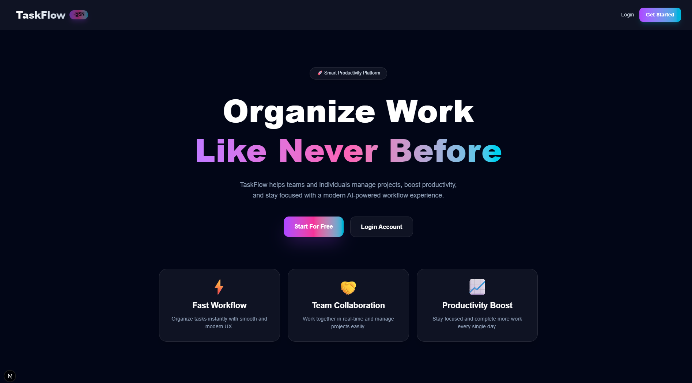

# 📝 TaskFlow - Modern Todo App

🚀 TaskFlow – Modern Full-Stack Todo App

TaskFlow is a sleek, full-stack productivity application built with Next.js that helps users manage daily tasks with speed, simplicity, and a beautiful UI experience.

---

## 📸 Preview

> Replace the above image link with your actual project screenshot (You can upload on GitHub or use Vercel deploy screenshot)

---

✨ Features
🔐 Secure Authentication (Login / Register)
📋 Create, Read, Update & Delete Todos
✅ Mark tasks as completed / pending
📊 Interactive dashboard with task insights
👤 User profile displayed in navbar
📱 Fully responsive design (mobile + desktop)
⚡ Lightning-fast performance with Next.js App Router

🛠️ Tech Stack :
Frontend
Next.js (App Router)
Tailwind CSS
Backend
Node.js
Express.js
Database
MongoDB
Authentication
JWT (JSON Web Token)
Notifications
React Hot Toast

🚀 Getting Started
1. Clone the repository
git clone https://github.com/adarshauspicious-art/TaskFlow-frontend.git
cd todo-frontend

2. Install dependencies
npm install
# or
yarn install

3. Setup environment variables

Create a .env.local file in the root directory:

NEXT_PUBLIC_API_URL=your_backend_url
JWT_SECRET=your_jwt_secret
MONGODB_URI=your_mongo_connection_string

4. Run the development server
npm run dev

Now open:

👉 http://localhost:3000

📦 Build for Production
npm run build
npm start
🤝 Contributing

Contributions are welcome!

Fork the repository
Create a new branch (feature/your-feature)
Commit your changes
Push and create a Pull Request
📄 License

This project is licensed under the MIT License.

🌟 Show Your Support

If you like this project:

⭐ Star the repository
🍴 Fork it
🛠️ Improve it